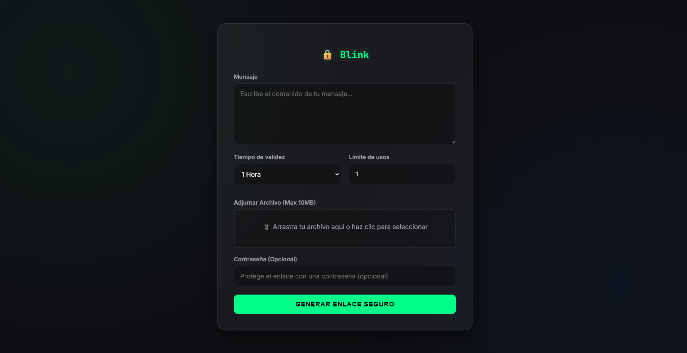
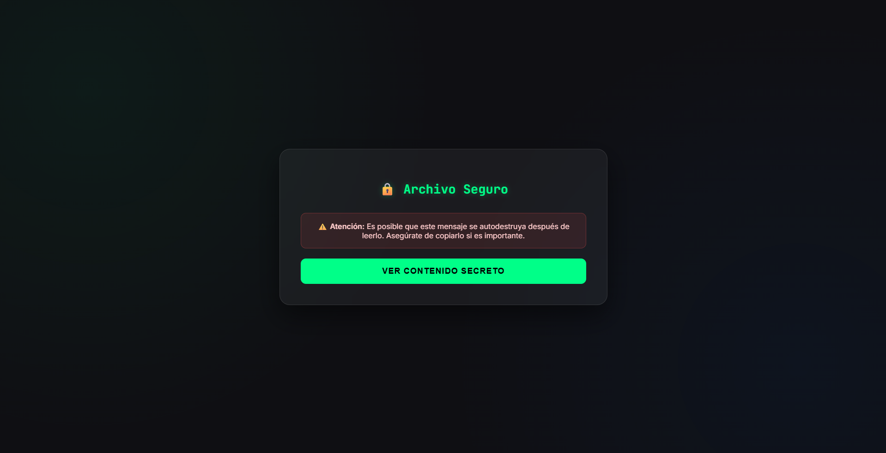
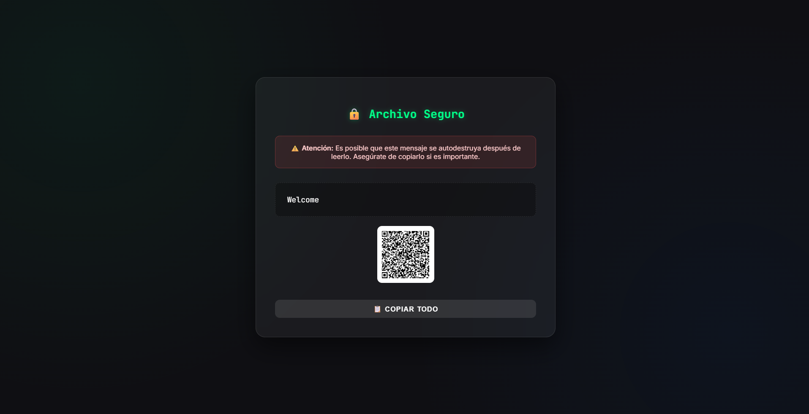

# Blink

---
## 🌐 Language / Idioma
- [English](#english) 🇬🇧
- [Español](#español) 🇪🇸

---

<a name="english"></a>
# 🇬🇧 ENGLISH VERSION

**Blink - Secure Message Sharing** is an open-source tool for securely sharing messages and files using end-to-end encryption. Messages self-destruct after being read or when their lifetime expires, ensuring total privacy.

**Sender:**


**Receiver notification:**


**Decrypted message**


## Features

- **End-to-end encryption** with 256-bit AES-GCM
- **Configurable lifetime** - Messages expire automatically
- **Optional password protection** - Additional security with PBKDF2
- **Attach files** up to 10MB (also encrypted)
- **QR codes** for easy link sharing
- **Zero-knowledge** - The server never sees the unencrypted content
- **Usage limit** - Control how many times the message can be accessed
- **Dockerized** for easy deployment

## Installation

### Installation with Docker

1. **Clone the repository:**
   ```bash
   git clone https://github.com/cristian-haro/blink.git
   cd blink
   ```

2. **Configure environment variables (optional):**
   
   Copy the example file:
   ```bash
   cp .env.example .env
   ```
   
   Edit `.env` according to your needs:
   ```env
   PORT=3000
   REDIS_URL=redis://redis-service:6379
   MAX_BODY_SIZE=50mb
   RATE_LIMIT_WINDOW_MS=900000
   RATE_LIMIT_MAX_REQUESTS=1000
   ```

3. **Start the application:**
   ```bash
   docker-compose up --build -d
   ```

4. **Access the application:**
   
   Open your browser at `http://localhost:3000`

### Production Installation

For production environments, use the `docker-compose.prod.yml` file:

```bash
docker-compose -f docker-compose.prod.yml up --build -d
```

Be sure to set the appropriate environment variables for production.

## User Guide

### Send a Secure Message

1. **Write your message** in the main text area
2. **Configure the options:**
   - **Validity period:** How long the message will be available (1 hour, 24 hours, 7 days)
   - **Usage limit:** How many times the message can be viewed (default: 1)
   - **Password (optional):** Additional password protection
3. **Attach a file (optional):** Drag and drop or click on the file area
4. **Click on “Generate Secure Link”**
5. **Share the generated link:**
   - Copy the link directly
   - Scan the QR code
   - Send by email

### Receive a Secure Message

1. **Open the link** that was shared with you
2. **If it is password protected:**
   - Enter the password provided
   - You have 3 attempts before the message self-destructs
3. **Click “View Secret Content”**
4. **Read the message and download any attachments**
5. **Copy the content** if you need to save it (the message will be destroyed)

> **IMPORTANT:** Do not reload the page after viewing the message, as it may self-destruct and you will lose access.

## Configuration

### Environment Variables

| Variable | Description | Default Value |
|----------|-------------|-------------------|
| `PORT` | Server port | `3000` |
| `REDIS_URL` | Redis connection URL | `redis://localhost:6379` |
| `MAX_BODY_SIZE` | Maximum request body size | `50mb` |
| `RATE_LIMIT_WINDOW_MS` | Time window for rate limiting (ms) | `900000` (15 min) |
| `RATE_LIMIT_MAX_REQUESTS` | Maximum requests per window | `1000` |

### Limits and Restrictions

- **Maximum file size:** 10 MB
- **Maximum lifetime:** 7 days
- **Password attempts:** 3 attempts before self-destruction
- **Maximum views:** Configurable (1-100)

---

### Security

#### Encryption
- **Algorithm:** 256-bit AES-GCM
- **Key derivation (with password):** PBKDF2 with 100,000 iterations and SHA-256
- **Initialization vector (IV):** 12 random bytes per message
- **Salt:** 16 random bytes for key derivation

#### Security Flow

1. **Sending:**
   - The message is encrypted in the sender's browser
   - Only encrypted data is sent to the server
   - The encryption key is included in the URL fragment (#) that never reaches the server

2. **Storage:**
   - Redis stores only encrypted data
   - Automatic TTL for expiration
   - View counter for self-destruction

3. **Receipt:**
   - The key is extracted from the URL fragment in the browser
   - Decryption occurs entirely on the client
   - The server never has access to the key or unencrypted content

## Project Structure

```
blink/
├── .maestro/            # Maestro E2E test suite
│   ├── config.yaml      # Maestro environment config
│   └── web/             # Automated E2E web flows
├── public/              # Static files
│   ├── i18n/            # Translation JSON files (en.json, es.json)
│   ├── i18n.js          # Internationalization utility
│   ├── index.html       # Main page (send)
│   ├── view.html        # Display page (receive)
│   ├── style.css        # Global styles
│   ├── app.js           # Sender logic
│   └── view.js          # Receiver logic
├── server.js            # Express server
├── package.json         # Node.js dependencies
├── Dockerfile           # Docker image
├── docker-compose.yml   # Development configuration
├── docker-compose.prod.yml  # Production configuration
├── .env.example         # Example environment variables
├── .dockerignore        # Files ignored by Docker
└── README.md            # User guide
```

## Testing & Quality Assurance (E2E Maestro)

Blink includes an automated end-to-end testing suite using [Maestro](https://maestro.mobile.dev/) for web verification:

```bash
# Run the complete web E2E test suite
npm run test:maestro

# Run tests targeting a custom deployment URL
maestro --env APP_URL=http://localhost:3000 test .maestro/web/

# Run a specific flow (e.g., language toggle)
maestro test .maestro/web/i18n-language-flow.yaml
```

## Privacy and Security

- **Zero-knowledge:** The server never has access to your unencrypted messages
- **No logging:** No content logs are stored
- **Self-destruction:** Messages are automatically deleted
- **Open source:** You can audit the entire code

---


<a name="español"></a>
# 🇪🇸 VERSIÓN EN ESPAÑOL

**Blink - Compartición Segura de Mensajes** es una herramienta de código abierto para compartir mensajes y archivos de forma segura mediante encriptación de extremo a extremo. Los mensajes se autodestruyen después de ser leídos o cuando expira su tiempo de vida, garantizando privacidad total.

Emisor:


Aviso receptor:


Mensaje desencriptado


## Características

- **Encriptación de extremo a extremo** con AES-GCM de 256 bits
- **Tiempo activo configurable** - Los mensajes expiran automáticamente
- **Protección por contraseña opcional** - Seguridad adicional con PBKDF2
- **Adjuntar archivos** hasta 10MB (también encriptados)
- **Códigos QR** para compartir enlaces fácilmente
- **Zero-knowledge** - El servidor nunca ve el contenido sin encriptar
- **Límite de usos** - Controla cuántas veces se puede acceder al mensaje
- **Dockerizado** para despliegue sencillo

## Instalación

### Instalación con Docker

1. **Clona el repositorio:**
   ```bash
   git clone https://github.com/cristian-haro/blink.git
   cd blink
   ```

2. **Configura las variables de entorno (opcional):**
   
   Copia el archivo de ejemplo:
   ```bash
   cp .env.example .env
   ```
   
   Edita `.env` según tus necesidades:
   ```env
   PORT=3000
   REDIS_URL=redis://redis-service:6379
   MAX_BODY_SIZE=50mb
   RATE_LIMIT_WINDOW_MS=900000
   RATE_LIMIT_MAX_REQUESTS=1000
   ```

3. **Inicia la aplicación:**
   ```bash
   docker-compose up --build -d
   ```

4. **Accede a la aplicación:**
   
   Abre tu navegador en `http://localhost:3000`

### Instalación para Producción

Para entornos de producción, utiliza el archivo `docker-compose.prod.yml`:

```bash
docker-compose -f docker-compose.prod.yml up --build -d
```

Asegúrate de configurar las variables de entorno apropiadas para producción.

## Guía de Uso

### Enviar un Mensaje Seguro

1. **Escribe tu mensaje** en el área de texto principal
2. **Configura las opciones:**
   - **Tiempo de validez:** Cuánto tiempo estará disponible el mensaje (1h, 24h, 7 días)
   - **Límite de usos:** Cuántas veces se puede ver el mensaje (por defecto: 1)
   - **Contraseña (opcional):** Protección adicional con contraseña
3. **Adjunta un archivo (opcional):** Arrastra y suelta o haz clic en la zona de archivos
4. **Haz clic en "Generar Enlace Seguro"**
5. **Comparte el enlace generado:**
   - Copia el enlace directamente
   - Escanea el código QR
   - Envía por correo electrónico

### Recibir un Mensaje Seguro

1. **Abre el enlace** que te compartieron
2. **Si está protegido por contraseña:**
   - Introduce la contraseña proporcionada
   - Tienes 3 intentos antes de que el mensaje se autodestruya
3. **Haz clic en "Ver Contenido Secreto"**
4. **Lee el mensaje y descarga archivos adjuntos** si los hay
5. **Copia el contenido** si necesitas guardarlo (el mensaje se destruirá)

> **IMPORTANTE:** No recargues la página después de ver el mensaje, ya que podría autodestruirse y perderás el acceso.

## Configuración

### Variables de Entorno

| Variable | Descripción | Valor por Defecto |
|----------|-------------|-------------------|
| `PORT` | Puerto del servidor | `3000` |
| `REDIS_URL` | URL de conexión a Redis | `redis://localhost:6379` |
| `MAX_BODY_SIZE` | Tamaño máximo del cuerpo de la petición | `50mb` |
| `RATE_LIMIT_WINDOW_MS` | Ventana de tiempo para rate limiting (ms) | `900000` (15 min) |
| `RATE_LIMIT_MAX_REQUESTS` | Máximo de peticiones por ventana | `1000` |

### Límites y Restricciones

- **Tamaño máximo de archivo:** 10 MB
- **Tiempo de vida máximo:** 7 días
- **Intentos de contraseña:** 3 intentos antes de autodestrucción
- **Vistas máximas:** Configurable (1-100)

---

### Seguridad

#### Encriptación
- **Algoritmo:** AES-GCM de 256 bits
- **Derivación de clave (con contraseña):** PBKDF2 con 100,000 iteraciones y SHA-256
- **Vector de inicialización (IV):** 12 bytes aleatorios por mensaje
- **Salt:** 16 bytes aleatorios para derivación de clave

#### Flujo de Seguridad

1. **Envío:**
   - El mensaje se encripta en el navegador del emisor
   - Solo los datos encriptados se envían al servidor
   - La clave de encriptación se incluye en el fragmento de URL (#) que nunca llega al servidor

2. **Almacenamiento:**
   - Redis almacena solo datos encriptados
   - TTL automático para expiración
   - Contador de vistas para autodestrucción

3. **Recepción:**
   - La clave se extrae del fragmento de URL en el navegador
   - La desencriptación ocurre completamente en el cliente
   - El servidor nunca tiene acceso a la clave o contenido sin encriptar

## Estructura del Proyecto

```
blink/
├── .maestro/            # Suite de pruebas E2E Maestro
│   ├── config.yaml      # Configuración de entorno Maestro
│   └── web/             # Flujos E2E automatizados
├── public/              # Archivos estáticos
│   ├── i18n/            # Archivos JSON de traducción (en.json, es.json)
│   ├── i18n.js          # Utilidad de internacionalización
│   ├── index.html       # Página principal (envío)
│   ├── view.html        # Página de visualización (recepción)
│   ├── style.css        # Estilos globales
│   ├── app.js           # Lógica del emisor
│   └── view.js          # Lógica del receptor
├── server.js            # Servidor Express
├── package.json         # Dependencias Node.js
├── Dockerfile           # Imagen Docker
├── docker-compose.yml   # Configuración desarrollo
├── docker-compose.prod.yml  # Configuración producción
├── .env.example         # Ejemplo de variables de entorno
├── .dockerignore        # Archivos ignorados por Docker
└── README.md            # Guía de uso
```

## Pruebas y Calidad (E2E Maestro)

Blink incluye una suite automatizada de pruebas end-to-end con [Maestro](https://maestro.mobile.dev/) para verificación web:

```bash
# Ejecutar la suite completa de tests E2E web
npm run test:maestro

# Ejecutar tests apuntando a una URL personalizada de despliegue
maestro --env APP_URL=http://localhost:3000 test .maestro/web/

# Ejecutar un flujo específico (ej. cambio de idioma)
maestro test .maestro/web/i18n-language-flow.yaml
```

## Privacidad y Seguridad

- **Zero-knowledge:** El servidor nunca tiene acceso a tus mensajes sin encriptar
- **Sin registro:** No se almacenan logs de contenido
- **Autodestrucción:** Los mensajes se eliminan automáticamente
- **Código abierto:** Puedes auditar el código completo

---
